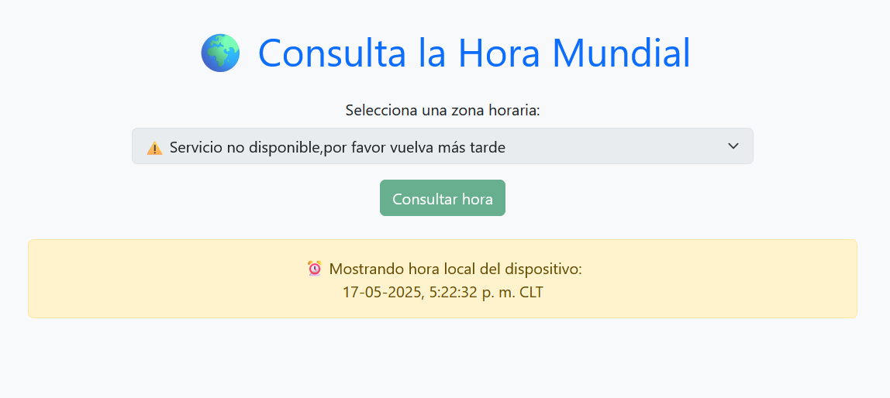

# 🌍 Consulta la Hora Mundial

Aplicación web desarrollada con **Python (Flask)** y **HTML + Bootstrap**, que permite a los usuarios consultar la hora actual en distintas zonas horarias del mundo utilizando la API pública de [WorldTimeAPI](https://worldtimeapi.org/).

Cuando la API externa no está disponible, el sistema muestra de forma automática la **hora local del dispositivo** como alternativa, actualizándola en tiempo real.

---

## 🚀 Funcionalidades

- Consulta de zonas horarias disponibles.
- Visualización de la hora actual en la zona seleccionada.
- Fallback automático a hora local en caso de caída de la API.
- Interfaz amigable, responsive y accesible con **Bootstrap**.

---

## 📸 Vista previa



---

## 🛠️ Tecnologías usadas

- Python 3.13
- Flask
- HTML5
- CSS3 (Bootstrap 5)
- JavaScript
- Fetch API

---

## ▶️ ¿Cómo ejecutarlo localmente?

1. Clona el repositorio:
   ```bash
   git clone https://github.com/tu-usuario/api-hora-mundial.git
   cd api-hora-mundial
2. Instala las dependencias:
   ```bash 
   pip install flask requests

3. Ejecutia la aplicación:
   ```bash 
   python app.py
   
4. Abre en tu navegador:
   ```bash 
   http://127.0.0.1:5000
   
💡 Autor

Daniela Castillo/Auraria ✨

Apasionada por la tecnología, la ciberseguridad y el desarrollo de soluciones digitales accesibles para todas las personas.

✨ Licencia

Este proyecto es de uso libre para fines educativos o personales.
¡Si lo reutilizas, mencióname para apoyar la visibilidad de más mujeres en tecnología!